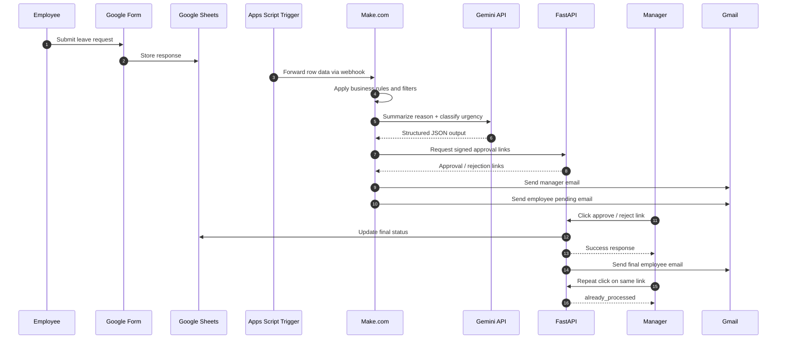

# Leave Request Automation System

An event-driven leave workflow that automates request intake, AI-assisted triage, approval routing, and status updates from submission to final decision.

 Full annotated screenshot walkthrough: [`docs/screenshots`](./docs/screenshots/)  
 Make.com automation blueprints: [`make-blueprints`](./make-blueprints/)

---

## Overview

Employees submit leave requests through a Google Form. The request is logged in Google Sheets, a lightweight trigger forwards the row data to a webhook, Gemini summarizes the leave reason and classifies urgency, and FastAPI issues signed approval/rejection links for the manager. The approved or rejected status is then written back automatically.

This repository contains the working backend and documentation assets:

- `main.py` — FastAPI backend
- `requirements.txt` — Python dependencies
- `README.md` — Setup and documentation
- `docs/screenshots/` — Annotated demo screenshots
- `make-blueprints/` — Make.com scenario blueprints (ready to import)

> A lightweight Google Apps Script trigger is used in the live workflow to detect new form responses, calculate leave days, and post the row data to the webhook. That trigger is not included in this repository.

---

## Problem Statement

Manual leave handling is slow and inconsistent. Requests can get lost in email threads, urgency is unclear, and status tracking across spreadsheets and inboxes becomes error-prone.

This system removes that manual coordination by automating:

- Intake
- Triage
- Approval routing
- Final status updates
- Notification delivery

---

## Key Features

- Google Form-based leave intake
- Automatic leave-days calculation before workflow routing
- Google Sheets as the shared operational data layer
- Make.com-based orchestration
- Gemini API for leave-reason summarization and urgency classification
- FastAPI backend for signed approval/rejection links
- Single-use approval flow with idempotency protection
- Automatic manager and employee notifications
- Conditional handling for requests with supporting documents

---

## System Architecture

```mermaid
flowchart LR
    A[Google Form] --> B[Google Sheets]
    B --> C[Lightweight Apps Script Trigger]
    C --> D[Webhook to Automation Layer]
    D --> E[Search Rows / Shared State]
    E --> F[Business Rules & Filters]
    F --> G[Gemini API]
    G --> H[Parse JSON]
    H --> I[Store AI Output]
    I --> J[FastAPI: Issue Signed Links]
    J --> K[Gmail: Manager Email]
    K --> L[Approval Records]
    L --> M[Gmail: Employee Pending Email]
    M --> N[Manager Clicks Link]
    N --> O[FastAPI: Verify Token]
    O --> P[Google Sheets: Status Update]
    P --> Q[Gmail: Final Employee Email]
    Q --> R[Idempotency Check]
```



---

## Workflow



---

## Demo

A full working demo is included as annotated screenshots in [`docs/screenshots`](./docs/screenshots/).

### 1) Scenario Overview


End-to-end workflow overview showing the connected modules and checked execution path.

### 2) Manager Inbox


Manager notification email containing the AI summary, urgency, and visible approval/rejection links.

### 3) FastAPI Confirmation


FastAPI backend confirmation showing the signed response returned to the scenario after approval action.

---

## What the Full Workflow Does

1. Employee submits a leave request through Google Form.
2. Google Sheets receives the response.
3. A lightweight trigger calculates leave days and forwards the row data to the webhook.
4. The automation layer applies business rules and filters.
5. Gemini summarizes the leave reason and classifies urgency.
6. Parsed output is stored back into the data flow.
7. FastAPI generates signed approval/rejection links.
8. Manager receives an email with the AI summary and action links.
9. Employee receives a pending notification.
10. Manager approves or rejects the request.
11. FastAPI verifies the token, updates Google Sheets, and sends the final employee email.
12. Repeated link clicks return `already_processed`.

---

## Design Decisions

- **Google Sheets as the shared state store** — Make.com free-plan Data Stores are account-isolated and do not support reliable approval-status checks across multiple scenarios. A sheet gives a single source of truth for duplicate checks and status tracking.
- **Make.com as orchestration** — keeps the workflow modular without custom middleware.
- **Gemini for triage, not final decisions** — AI assists with summarization and urgency only.
- **FastAPI for secure approval links** — signed tokens reduce the risk of forged or replayed actions.
- **Idempotent approval endpoint** — protects against duplicate clicks and repeated processing.
- **Conditional document branch** — document handling runs only when a supporting file exists.

---

## Tech Stack

| Component | Technology | Purpose |
|---|---|---|
| Intake Form | Google Forms | Leave request data capture |
| Shared Data Layer | Google Sheets | Operational persistence, duplicate checks, audit trail |
| Trigger | Google Apps Script | Detects new responses and forwards row data |
| Orchestration | Make.com | Workflow automation |
| AI Triage | Gemini API | Summarization & urgency classification |
| Backend | FastAPI (Python) | Signed link issuance & token verification |
| Notifications | Gmail | Manager and employee communication |

---

## Repository Structure

```
.
├── README.md
├── main.py
├── requirements.txt
├── docs/
│   └── screenshots/
│       ├── 01-scenario-overview.png
│       ├── 02-manager-inbox.png
│       └── 03-fastapi-confirmation.png
└── make-blueprints/
    ├── blueprint-1.json
    ├── blueprint-2.json
    └── blueprint-3.json
```

---

## Setup Steps

### 1. Organize Your Repository

Move your files to match this structure:

```bash
# Create docs/screenshots folder structure
mkdir -p docs/screenshots

# Move your 3 screenshots to docs/screenshots/
mv 01-scenario-overview.png docs/screenshots/
mv 02-manager-inbox.png docs/screenshots/
mv 03-fastapi-confirmation.png docs/screenshots/

# Keep make-blueprints folder at root (it already has your JSON files)
# Your folder structure should now look like the example above
```

---

### 2. Install Python Dependencies

```bash
pip install -r requirements.txt
```

---

### 3. Configure Environment Variables

Create a `.env` file in the repository root with your credentials:

```env
GOOGLE_SHEETS_API_KEY=your_google_api_key
GEMINI_API_KEY=your_gemini_api_key
GMAIL_API_KEY=your_gmail_api_key
FASTAPI_SECRET_KEY=your_secret_key_for_signing_tokens
```

> **Security Note:** Never commit `.env` to version control. Add it to `.gitignore`.

---

### 4. Deploy FastAPI Backend

**Local Testing:**
```bash
uvicorn main:app --reload
```

**Production:**
- Deploy to Heroku, Railway, Google Cloud Run, or AWS Lambda
- Set environment variables in your deployment platform

---

### 5. Import Make.com Blueprints

1. Open [Make.com](https://make.com)
2. Go to **Templates** → **Import a Blueprint**
3. For each JSON file in `make-blueprints/`:
   - Click **Import** 
   - Upload the `.json` blueprint file
   - Configure connections:
     - **Google Sheets** — Connect your Google account
     - **Gemini API** — Add your API key
     - **Gmail** — Connect your Gmail account
     - **FastAPI Webhook** — Set to your deployed FastAPI URL
4. Enable each scenario and test with a sample leave request

**Blueprint Configuration Reference:**
- Update Google Sheets spreadsheet IDs in each module
- Set your Gmail sender email address
- Configure FastAPI webhook URL (e.g., `https://your-api.com/approve`)
- Test each approval link in the manager email before going live

---

### 6. Set Up Google Form & Sheets

1. Create a Google Form for leave requests (Title, Leave Dates, Reason, etc.)
2. Link responses to a Google Sheet
3. Add columns for:
   - Employee Name
   - Leave Dates
   - Number of Days
   - Reason
   - Status (Auto-filled by workflow)
   - AI Summary (Auto-filled by Gemini)
   - Urgency (Auto-filled by Gemini)

---

### 7. Deploy Google Apps Script Trigger

In your Google Sheet, go to **Extensions** → **Apps Script** and add a trigger that:

1. Detects new form responses
2. Calculates leave days
3. Sends row data to your Make.com webhook

> This script is not included in this repository. Use the Make.com blueprint as a reference for expected data format.

---

## Security & Idempotency

Approval and rejection links are signed, single-use tokens issued by the FastAPI backend. They cannot be guessed or reused after processing.

Every verification checks the current request state before acting. If the request has already been processed, the backend returns `already_processed` instead of repeating the update or sending duplicate notifications.

No secrets are committed to the repository. Credentials are expected to be provided through environment variables.

---

## Troubleshooting

### Screenshots Not Showing in README?
- Ensure files are in `docs/screenshots/` with exact filenames
- Commit and push to GitHub
- GitHub takes ~30 seconds to cache; refresh the page

### Make.com Blueprint Import Fails?
- Check that all `.json` files are valid JSON (use a JSON validator if unsure)
- Ensure Make.com account is active and API tier allows scenarios
- Verify all connection credentials are current (API keys, Gmail access, etc.)

### FastAPI Not Receiving Webhook Data?
- Check that Make.com scenario is enabled
- Verify FastAPI is running and URL is correct
- Check FastAPI logs for 404 or authentication errors
- Test webhook with a curl request:
  ```bash
  curl -X POST http://localhost:8000/webhook \
    -H "Content-Type: application/json" \
    -d '{"employee":"test","days":1}'
  ```

---

## Notes

- The demo uses a normal unique leave request under 5 days.
- No supporting document is attached in the demo path.
- The Google Drive branch is expected to be skipped in that run.
- The screenshot walkthrough is the primary proof of working functionality for this repository.

---

## Documentation

-  Full annotated workflow: [`docs/screenshots`](./docs/screenshots/)
-  Make.com blueprints: [`make-blueprints`](./make-blueprints/)
-  API endpoints and token signing: See `main.py` docstrings
