# Leave Request Automation System

## Overview

An automated, end-to-end leave request system that removes manual handling from submission to approval. Employees submit requests via a Google Form; the system classifies urgency, notifies the right people, and updates records automatically — with no manual data entry or status tracking required.

## Problem Statement

Manual leave request handling is slow and error-prone: requests get lost in email threads, managers lack context on urgency, and status tracking across spreadsheets and inboxes is inconsistent. This system automates intake, AI-assisted triage, approval routing, and status updates in a single pipeline.

## System Architecture

```mermaid
graph LR
    A[Google Form] --> B[Google Sheets]
    B --> C[Apps Script]
    C --> D[Make.com Webhook]
    D --> E[Search Rows: Data Store]
    E --> F[Filter]
    F --> G[Gemini API]
    G --> H[Parse JSON]
    H --> I[Add Row: Data Store]
    I --> J[FastAPI: Issue Links]
    J --> K[Gmail: Manager Email]
    K --> L[Add Row: Approval Records]
    L --> M[Gmail: Employee Pending Email]
    M --> N[Manager Clicks Link]
    N --> O[FastAPI: Verify Token]
    O --> P[Sheets: Status Update]
    P --> Q[Gmail: Final Employee Email]
    Q --> R[Idempotency Check]
```



## Workflow

1. **Intake** — Employee submits a leave request via Google Form; the response is logged in Google Sheets.
2. **Trigger** — A minimal Apps Script trigger detects the new form response and invokes the Make.com webhook.
3. **Processing** — Make.com searches the data store, filters requests by leave duration and attachment status, and sends the leave reason to the Gemini API for summarization and urgency classification.
4. **Persistence** — The parsed AI output is written back to the data store as a new row.
5. **Approval Routing** — Make.com calls the FastAPI backend to generate signed, single-use approval/rejection links, then emails the manager (with AI summary and urgency) and the employee (pending notification).
6. **Decision** — The manager clicks a link; FastAPI verifies the token, updates the status in Google Sheets, and triggers the final employee email.
7. **Idempotency** — Any repeated click on the same link returns `already_processed` instead of reprocessing the request.

## Key Design Decisions

- **Google Sheets as the operational data store** — no external database; keeps the system lightweight and auditable.
- **Make.com as the orchestration layer** — visual, maintainable automation without custom middleware.
- **Gemini for triage, not decisions** — AI summarizes and classifies urgency; humans retain approval authority.
- **FastAPI for secure link issuance** — signed tokens ensure approval actions can't be forged or replayed.
- **Idempotent approval endpoint** — protects against duplicate actions from repeated link clicks (e.g., email client prefetching, double-clicks).
- **Conditional Drive branch** — document download/parsing only runs when a supporting file is attached, keeping the default path fast.

## Tech Stack

| Component | Technology | Purpose |
|---|---|---|
| Intake Form | Google Forms | Leave request data capture |
| Data Store | Google Sheets | Operational persistence & audit trail |
| Trigger | Google Apps Script | Fires the Make.com webhook on new form submission |
| Orchestration | Make.com | End-to-end workflow automation |
| AI Triage | Gemini API | Summarization & urgency classification |
| Backend | FastAPI (Python) | Signed link issuance & token verification |
| Notifications | Gmail | Manager and employee communications |

## Setup Guide

1. **Clone the repository** and review `docs/` for scenario references.
2. **Google Form & Sheet** — Create the form and link it to a response sheet matching the expected schema.
3. **Apps Script** — Deploy the minimal trigger script in `apps-script/`; set the Make.com webhook URL.
4. **Make.com Scenario** — Import the blueprint from `make-scenario/`; connect Google Sheets, Gemini API, Gmail, and HTTP modules with your credentials.
5. **Gemini API** — Add your API key to the relevant Make.com module.
6. **FastAPI Backend** — Deploy `backend/`; set environment variables (signing secret, sheet credentials, base URL) from `.env.example`.
7. **Gmail** — Authorize the Gmail connection used for manager and employee notifications.
8. **Test** — Submit a sample request to validate the full pipeline end to end.

## Repository Structure

```
.
├── apps-script/
│   └── Code.gs
├── backend/
│   ├── main.py
│   ├── requirements.txt
│   └── .env.example
├── make-scenario/
│   └── scenario-blueprint.json
├── docs/
│   └── screenshots/
└── README.md
```

## Security & Idempotency

Approval and rejection links are signed, single-use tokens issued by the FastAPI backend — they cannot be guessed or reused after processing. Every verification checks the current status in Google Sheets before acting; a link that has already been processed returns `already_processed` rather than repeating the status update or re-sending notifications. No secrets are stored in the repository — all credentials are supplied via environment variables.

## Demo

The demo below traces a single, unique leave request: a standard request under 5 days with no supporting document attached, from submission through final approval.

## End-to-End Workflow Demo

This demo uses a normal, unique leave request (under 5 days, no supporting document). As a result, the Google Drive download branch is expected to be skipped throughout the run.

**[Insert Screenshot 1: Google Form - Leave Request Submission]**
*Caption: Step 1: Form Submission*
> Employee submits the leave request through the Google Form, initiating the automation pipeline.

**[Insert Screenshot 2: Google Sheets - Form Responses 1]**
*Caption: Step 2: Response Logged in Google Sheets*
> The response appears in "Form responses 1", where a minimal Apps Script trigger fires the Make.com webhook.

**[Insert Screenshot 3: Make.com - Scenario 1 Execution Overview]**
*Caption: Step 3: Successful Scenario Execution*
> The execution overview shows the successful run path; Drive-related modules appear skipped since no document was uploaded.

**[Insert Screenshot 4: Make.com - Parse JSON Module Output]**
*Caption: Step 4: Gemini Output Parsed*
> The Gemini response is parsed into structured fields, with summary and urgency as the key extracted values.

**[Insert Screenshot 5: Make.com - HTTP Module Response]**
*Caption: Step 5: FastAPI Approval Links Generated*
> The HTTP module receives a 200 OK response from the FastAPI backend containing signed approval and rejection links.

**[Insert Screenshot 6: Gmail - Manager Approval Request Email]**
*Caption: Step 6: Manager Notification Sent*
> The manager receives an email containing the AI-generated summary, urgency level, and approval/rejection links.

**[Insert Screenshot 7: Gmail - Employee Pending Notification]**
*Caption: Step 7: Employee Notified of Pending Request*
> The employee receives confirmation that the request was received and is pending manager approval.

**[Insert Screenshot 8: Browser/Terminal - Approval Link Response]**
*Caption: Step 8: Manager Approves the Request*
> The manager clicks the Approve link; the FastAPI backend returns a success JSON response confirming approval.

**[Insert Screenshot 9: Google Sheets - Approved Status Update]**
*Caption: Step 9: Status Updated in Google Sheets*
> The corresponding row in Google Sheets is updated to reflect the approved status.

**[Insert Screenshot 10: Gmail - Employee Approval Notification]**
*Caption: Step 10: Employee Receives Final Approval Email*
> The employee receives the final notification confirming the leave request has been approved.

**[Insert Screenshot 11: Browser/Terminal - Idempotency Check Response]**
*Caption: Step 11: Idempotency Verified on Repeated Click*
> The same approval link is clicked again; the backend returns `already_processed`, confirming idempotent behavior.
